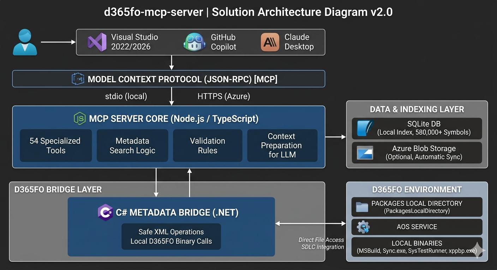
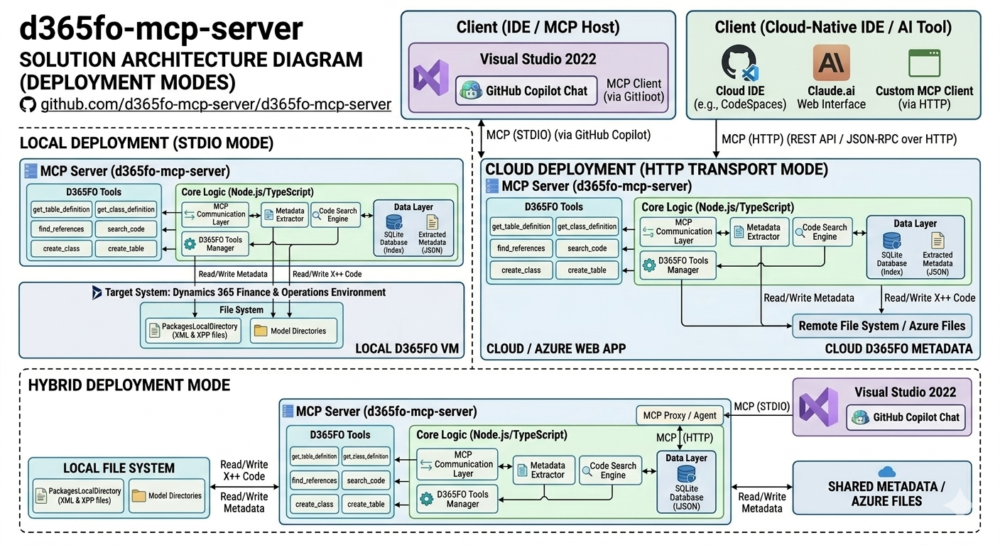

# D365 F&O MCP Server

<div align="center">

**43 AI tools that know every X++ class, table, method, and EDT in your D365FO codebase**

[](https://opensource.org/licenses/MIT)
[](https://nodejs.org/)
[](https://www.typescriptlang.org/)

*Built for D365FO developers who write X++ in Visual Studio — not for generic web dev*

</div>

---

## Why this exists

GitHub Copilot is great at C#, Python, and JavaScript. It struggles with X++ because it doesn't know your D365FO codebase: method signatures, field types, which CoC extensions already exist, or how your custom ISV code is structured.

This MCP server pre-indexes your entire D365FO installation — 584,799+ symbols — and makes it available to Copilot as 43 specialized tools. Copilot stops guessing and starts generating code that compiles on the first try.



| Without this server | With this server |
|---------------------|-----------------|
| Copilot guesses method signatures → compile errors | Exact signatures from your actual codebase |
| "Does CustTable.validateWrite() have any CoC wrappers?" requires manual AOT search | `find_coc_extensions` answers in < 50 ms |
| ISV extensions invisible to Copilot | Custom models fully indexed and searchable |
| Security hierarchy takes hours to trace manually | `get_security_coverage_for_object` traces Role → Duty → Privilege → Entry Point instantly |

---

## Quick Start

**Prerequisites** — install [d365fo.tools](https://github.com/d365collaborative/d365fo.tools) if not already present:

```powershell
Install-Module -Name d365fo.tools -AllowClobber -Scope CurrentUser  # first time
Update-Module -Name d365fo.tools                                     # or update existing
```

```powershell
git clone https://github.com/dynamics365ninja/d365fo-mcp-server.git
cd d365fo-mcp-server
npm install
copy .env.example .env           # Set PACKAGES_PATH, CUSTOM_MODELS, DB_PATH, LABEL_LANGUAGES, ...
npm run extract-metadata         # Extract XML from D365FO packages (~10–60 min)
npm run build-database           # Build SQLite index (~5–20 min)
npm run dev                      # Server at http://localhost:8080
```

> **UDE / Power Platform Tools?** Run `npm run select-config` instead of setting `PACKAGES_PATH` manually.

---

## Connect to GitHub Copilot

**1.** Enable *MCP servers in Copilot* at **github.com/settings/copilot/features**

**2.** In Visual Studio: **Tools → Options → GitHub → Copilot** → check *Enable MCP server integration in agent mode*

**3.** Create `%USERPROFILE%\.mcp.json` (covers all solutions on the machine, recommended) or place `.mcp.json` next to a specific `.sln` file:

```json
{
  "servers": {
    "d365fo-azure": {
      "url": "https://your-server.azurewebsites.net/mcp/"
    },
    "d365fo-local": {
      "command": "node",
      "args": ["K:\\d365fo-mcp-server\\dist\\index.js"],
      "env": {
        "MCP_SERVER_MODE": "write-only",
        "D365FO_SOLUTIONS_PATH": "K:\\VSProjects\\MySolution"
      }
    },
    "context": {
      "workspacePath": "K:\\AosService\\PackagesLocalDirectory\\YourPackageName\\YourModelName"
    }
  }
}
```

**4.** Copy the Copilot instruction files so Copilot knows the D365FO workflow rules:

```powershell
# Place .github in a parent folder shared by all your D365FO solutions, e.g.:
Copy-Item -Path ".github" -Destination "C:\source\repos\" -Recurse
```

> **Tip:** Visual Studio 2022 searches for `.github\copilot-instructions.md` upward from the solution folder, so one copy in a common parent directory covers all solutions underneath — no need to copy it into every solution separately.

> **Full config options** (UDE paths, explicit projectPath, solutionPath): [docs/MCP_CONFIG.md](docs/MCP_CONFIG.md)

---

## What Copilot can do — 43 X++ tools

### Workspace & Diagnostics
| Ask Copilot | Tool used |
|-------------|-----------|
| `Is the MCP server connected and which model am I working in?` | `get_workspace_info` |

### Search & Discovery
| Ask Copilot | Tool used |
|-------------|-----------|
| `What methods does SalesTable have?` | `get_table_info` |
| `Find all classes related to dimension validation` | `search` |
| `Does CustTable have any CoC extensions in our code?` | `find_coc_extensions` |
| `Show me only our ISV customizations, not Microsoft code` | `search_extensions` |
| `Who calls SalesFormLetter.run()?` | `find_references` |
| `Search for "invoice" and "posting" at the same time` | `batch_search` |

### Code Generation
| Ask Copilot | Tool used |
|-------------|-----------|
| `Write a CoC extension for SalesTable.insert()` | `get_method_signature` + `generate_code` |
| `Create a SysOperation batch job for order processing` | `generate_code` (sysoperation pattern) |
| `Add an event handler for CustTable.onInserted` | `generate_code` (event-handler pattern) |
| `How is LedgerJournalEngine used in our codebase?` | `get_api_usage_patterns` |
| `Is my new helper class missing any standard methods?` | `analyze_class_completeness` |

### Object Inspection
| Ask Copilot | Tool used |
|-------------|-----------|
| `Show me the full source of SalesFormLetter` | `get_class_info` |
| `What fields and indexes does InventTable have?` | `get_table_info` |
| `Show me the SalesTable form structure` | `get_form_info` |
| `What values does SalesStatus enum have?` | `get_enum_info` |
| `What EDT should I use for a customer account field?` | `suggest_edt` |
| `Show me the ancestor chain of AccountNum EDT` | `get_edt_info` (hierarchy mode) |

### Smart Object Creation *(local VM only)*
| Ask Copilot | Tool used |
|-------------|-----------|
| `Generate a transaction table with common fields` | `generate_smart_table` |
| `Create a SimpleList form for MyOrderTable` | `generate_smart_form` |
| `Create a security privilege + duty for our new form` | `generate_code` (security-privilege pattern) |
| `Add a new field TransQty (EDT: InventQty) to my table` | `modify_d365fo_file` |
| `Create a new class and add it to the VS project` | `create_d365fo_file` |
| `Check that all created objects exist on disk and in the project` | `verify_d365fo_project` |

### Security & Extensions
| Ask Copilot | Tool used |
|-------------|-----------|
| `What roles have access to the CustTable form?` | `get_security_coverage_for_object` |
| `Show me the full privilege chain for AccountsReceivableClerk` | `get_security_artifact_info` |
| `What extension points does SalesLine have?` | `analyze_extension_points` |
| `Which models extend CustTable?` | `get_table_extension_info` |
| `Is the onInserted event on SalesLine already handled?` | `find_event_handlers` |

### Label Management
| Ask Copilot | Tool used |
|-------------|-----------|
| `Find an existing label for "customer account"` | `search_labels` |
| `Create label MyNewField in MyModel (EN + CS)` | `create_label` |
| `Rename label OldName to NewName everywhere` | `rename_label` |

---

## Azure Deployment

Host on Azure App Service so the whole team shares one instance — nobody needs the server running locally.



| Resource | Configuration | Monthly cost |
|----------|---------------|-------------|
| App Service Basic B3 | 4 vCPU, 7 GB RAM | ~$52 |
| Blob Storage | ~2.5–3.5 GB (symbols + labels, without/with UnitTest models) | ~$3 |
| Azure Managed Redis (optional) Basic B0 | 2 vCPU, 0.5 GB Cache | ~$27 |
| **Total without Redis** | | **~$55 / month** |

The database downloads from Azure Blob Storage automatically on startup.

Setup guide: [docs/SETUP.md](docs/SETUP.md) · CI/CD pipeline: [docs/PIPELINES.md](docs/PIPELINES.md)

---

## Documentation

| File | Contents |
|------|---------|
| [docs/SETUP.md](docs/SETUP.md) | Installation, configuration, Azure deployment |
| [docs/MCP_CONFIG.md](docs/MCP_CONFIG.md) | `.mcp.json` reference — workspace paths, UDE, project settings |
| [docs/MCP_TOOLS.md](docs/MCP_TOOLS.md) | All 43 tools with parameters and example prompts |
| [docs/USAGE_EXAMPLES.md](docs/USAGE_EXAMPLES.md) | Practical examples: search, CoC, SysOperation, security |
| [docs/ARCHITECTURE.md](docs/ARCHITECTURE.md) | Technical architecture, dual-database design |
| [docs/CUSTOM_EXTENSIONS.md](docs/CUSTOM_EXTENSIONS.md) | ISV / custom model configuration |
| [docs/PIPELINES.md](docs/PIPELINES.md) | Automated metadata extraction via Azure DevOps |
