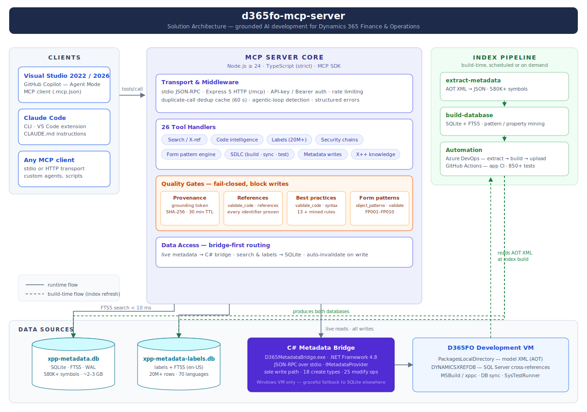
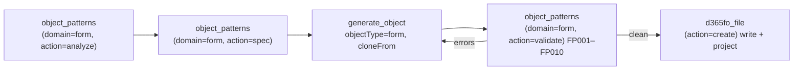

# D365 F&O MCP Server

<div align="center">

**26 AI tools that know every X++ class, table, form, and EDT in your D365FO codebase**

[](https://opensource.org/licenses/MIT)
[](https://nodejs.org/)
[](https://www.typescriptlang.org/)
[](docs/TESTING.md)

*Grounded AI development for Dynamics 365 Finance & Operations — built for Claude Code*

</div>

---

## ⚡ Deployment & setup — start here

Two maintained, end-to-end instruction guides live in the repo root. Pick the one that matches how you run the server:

| Guide | Use it when | What it gives you |
|---|---|---|
| **[Azure (hybrid) — main deployment guide](<README - Azure MCP server for D365FnO - instruction.md>)** | **Team setup (recommended).** Shared read-only MCP on Azure + a local write-only companion on each developer's VM. | Azure App Service + metadata pipelines, then a one-command local companion via `scripts\local\setup-dev.ps1` (installs prerequisites, builds, wires MCP into Claude Code, named profiles, VS Code desktop shortcut). |
| **[Local — single-VM guide](<README - local MCP server for D365FnO - instruction.md>)** | **One developer, everything on the D365FO VM.** No Azure. | Build + index locally, run the server over HTTP, wire it into Claude Code. |

> These two files are the **current source of truth** for deployment. The [`docs/`](#documentation) folder holds deeper reference material, aligned with these guides — if anything there ever conflicts, the guides win.

---

## Why

AI assistants excel at C#, Python, and JavaScript. X++ is different: your D365FO codebase is private, deeply customized, and invisible to every model — so AI confidently generates code that doesn't compile.

This server pre-indexes your entire D365FO installation (580 000+ symbols across standard, ISV, and custom models) and exposes it as 26 specialized MCP tools. Every signature, every CoC wrapper, every label, every form pattern — verified against your real metadata **before** the AI writes a single line.



| Task | Without this server | With this server |
|------|--------------------|------------------|
| Method signatures | Guessed → compile errors | Exact, from your codebase |
| Existing CoC wrappers | Manual AOT search | `extension_info(mode="coc")` in < 50 ms |
| New forms | Hand-written XML, broken patterns | Cloned from reference forms, validated against the pattern catalog |
| Labels | Hardcoded strings | Right `@SYS`/`@MODULE` key found instantly |
| Security chains | Hours of manual tracing | Role → Duty → Privilege → Entry Point in one call |
| Generated code | Hallucinated fields and types | Every reference proven against the index, gated before write |

---

## Capabilities

| Feature | Description |
|---|---|
| 🔍 **Full-codebase intelligence** | 580K+ symbols indexed: classes, tables, forms, EDTs, enums, labels (20M+ rows), security artifacts — FTS5 search in < 10 ms |
| 🛡️ **Grounded generation** | Fail-closed gates: `prepare` issues grounding tokens, `validate_code(mode="references")` proves every identifier, `validate_code(mode="syntax")` enforces best practices — hallucinated code never reaches disk |
| 🧩 **Form pattern engine** | Complete catalog of Microsoft form patterns and sub-patterns: recommends the right pattern, clones reference forms with datasource re-binding, validates structure and blocks invalid writes |
| ✍️ **Safe metadata writes** | C# bridge uses Microsoft's own `IMetadataProvider` — no string-replacement XML corruption, automatic `.rnrproj` registration, one-call undo |
| 🏗️ **SDLC integration** | MSBuild compilation with structured diagnostics, DB sync, xppbp best practices, SysTestRunner — all from chat |
| 📐 **X++ knowledge base** | Queryable rules: select grammar, CoC authoring, SysDa, FormRun lifecycle, AX2012→D365FO migration — prevents deprecated APIs |

### Pattern-grounded form development

Forms are the hardest artifact to generate correctly — each pattern dictates required containers, ordering, and allowed sub-patterns. The form pattern engine makes it a guided pipeline:



Structural violations (wrong order, missing container, disallowed control) **block the write** — recommendations only warn. Mined pattern statistics from your own environment ground every suggestion in reality.

---

## Verify it's connected

After following either deployment guide, open a new Claude Code chat and ask:

```
What tables contain a "CustAccount" field?
```

A `search` tool call returning results from your codebase = you're connected.

---

## Documentation

> Reference / deep-dive material, reviewed and aligned with the two deployment instruction guides at the top (repo links, Claude Code integration, tool names). Those guides stay **canonical for deployment** — if anything here ever conflicts with them, the guides win.

| Getting started | Reference | Operations |
|-----------------|-----------|------------|
| [Quick Start](docs/QUICK_START.md) | [All 26 tools](docs/MCP_TOOLS.md) | [Azure deployment](docs/SETUP_AZURE.md) |
| [Setup scenarios A–F](docs/SETUP.md) | [MCP config reference](docs/MCP_CONFIG.md) | [DevOps pipelines](docs/PIPELINES.md) |
| [Claude Code setup](docs/CLAUDE_CODE_SETUP.md) | [Architecture](docs/ARCHITECTURE.md) | [Testing](docs/TESTING.md) |
| [Usage examples](docs/USAGE_EXAMPLES.md) | [C# Bridge](docs/BRIDGE.md) | [Custom / ISV models](docs/CUSTOM_EXTENSIONS.md) |
| [X++ development with MCP](docs/XPP_DEVELOPMENT_WITH_MCP.md) | [Workspace detection](docs/WORKSPACE_DETECTION.md) | [SQLite vs Bridge](docs/SQLITE_DEPENDENCY.md) |
| | [Backlog](docs/BACKLOG.md) — deferred work & ideas | |

## License

MIT
