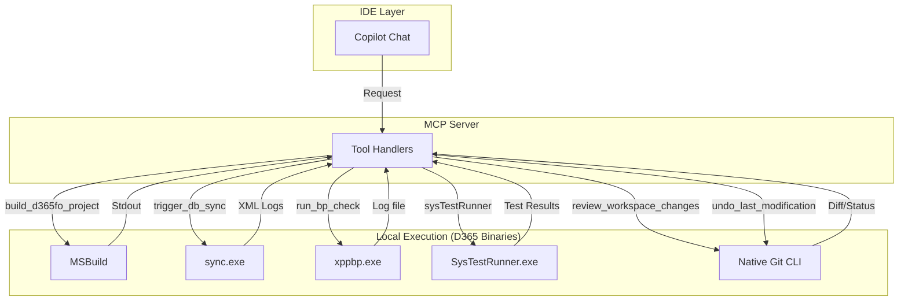

# Architecture Overview

This document provides visual diagrams and detailed explanations of the D365 F&O MCP Server architecture.

## Table of Contents

1. [High-Level Architecture](#high-level-architecture)
2. [Request Flow](#request-flow)
3. [Component Architecture](#component-architecture)
4. [Data Flow](#data-flow)
5. [Deployment Architecture](#deployment-architecture)
6. [Database Schema](#database-schema)

---

## High-Level Architecture

````mermaid
graph TB
    subgraph "Client Layer"
        VS[Visual Studio 2022 17.14+ GitHub Copilot Agent Mode]
        VS2026[Visual Studio 2026 GitHub Copilot Agent Mode]
    end

    subgraph "Azure Cloud"
        subgraph "App Service"
            MCP[MCP Server - Node.js 24 LTS, Express 5.x HTTP]
        end
        
        subgraph "Storage"
            BLOB[Azure Blob Storage - Symbols and Labels DBs]
        end
    end

    subgraph "MCP Server Components"
        HTTP[HTTP Transport Layer - Express + Rate Limiting]
        PROTO[MCP Protocol Handler - JSON-RPC 2.0]
        TOOLS[Tool Handlers - 53 MCP Tools]
        DB[(Symbols Database - FTS5, 584K+ symbols)]
        LDB[(Labels Database - FTS5, 19M+ labels, 70 languages)]
        CACHE[Redis Cache - Optional]
    end

    VS -->|"Streamable HTTP, OAuth 2.0"| MCP
    VS2026 -->|"Streamable HTTP, OAuth 2.0"| MCP
    MCP -->|"Download on startup"| BLOB
    MCP --> HTTP
    HTTP --> PROTO
    PROTO --> TOOLS
    TOOLS --> DB
    TOOLS --> LDB
    TOOLS -.->|"Optional"| CACHE
    
    style VS fill:#68217A,color:#fff
    style VS2026 fill:#0078D4,color:#fff
    style MCP fill:#00A4EF,color:#fff
    style BLOB fill:#FF6C00,color:#fff
    style DB fill:#4CAF50,color:#fff
    style LDB fill:#4CAF50,color:#fff
    style CACHE fill:#DC382D,color:#fff
```

---

## Request Flow

````mermaid
sequenceDiagram
    participant IDE as Visual Studio 2022 / 2026
    participant HTTP as HTTP Transport
    participant MCP as MCP Protocol
    participant Handler as Tool Handler
    participant Tool as Tool Implementation
    participant Cache as Redis Cache
    participant DB as SQLite DB

    IDE->>HTTP: POST /mcp JSON-RPC Request
    HTTP->>HTTP: Rate Limit Check
    HTTP->>MCP: Parse JSON-RPC
    MCP->>MCP: Route Method
    
    alt Initialize
        MCP-->>IDE: Server Capabilities
    else Tools List
        MCP-->>IDE: 53 Tool Definitions
    else Tool Call
        MCP->>Handler: Route to Handler
        Handler->>Tool: Execute Tool
        Tool->>Cache: Check Cache
        alt Cache Hit
            Cache-->>Tool: Cached Result
        else Cache Miss
            Tool->>DB: FTS5 Query
            DB-->>Tool: Symbol Results
            Tool->>Cache: Store Result
        end
        Tool-->>Handler: Tool Result
        Handler-->>MCP: Formatted Response
        MCP-->>IDE: JSON-RPC Response
    end
```

---

## Component Architecture

````mermaid
graph LR
    subgraph "Entry Point"
        INDEX[index.ts - Main Entry]
    end

    subgraph "Server Layer"
        SERVER[mcpServer.ts - MCP Server Config]
        TRANSPORT[transport.ts - HTTP Transport]
        HANDLER[toolHandler.ts - Tool Router]
    end

    subgraph "Tool Layer"
        subgraph "Search & Discovery"
            SEARCH[search.ts - search]
            BATCH[batchSearch.ts - batch_search]
            EXT[extensionSearch.ts - search_extensions]
            REFS[findReferences.ts - find_references]
            COMP[completion.ts - code_completion]
        end
        subgraph "Object Info"
            CLASS[classInfo.ts - get_class_info]
            TABLE[tableInfo.ts - get_table_info]
            FORM[formInfo.ts - get_form_info]
            QUERY[queryInfo.ts - get_query_info]
            VIEW[viewInfo.ts - get_view_info]
            ENUM[enumInfo.ts - get_enum_info]
            EDT[edtInfo.ts - get_edt_info]
            REPORT[reportInfo.ts - get_report_info]
            ENTITY[dataEntityInfo.ts - get_data_entity_info]
            SIGNATURE[methodSignature.ts - get_method_signature]
            MSRC[getMethodSource.ts - get_method_source]
        end
        subgraph "Extensions & Security"
            COCEXT[findCocExtensions.ts - find_coc_extensions]
            EVTHDL[findEventHandlers.ts - find_event_handlers]
            TBLEXT[tableExtensionInfo.ts - get_table_extension_info]
            EXTPTS[analyzeExtensionPoints.ts - analyze_extension_points]
            SECART[securityArtifactInfo.ts - get_security_artifact_info]
            SECCOV[securityCoverageInfo.ts - get_security_coverage_for_object]
            MENU[menuItemInfo.ts - get_menu_item_info]
        end
        subgraph "Code Generation"
            GEN[codeGen.ts - generate_code]
            GENXML[generateD365Xml.ts - generate_d365fo_xml]
            CREATE[createD365File.ts - create_d365fo_file]
            MODIFY[modifyD365File.ts - modify_d365fo_file]
            SMTABLE[generateSmartTable.ts - generate_smart_table]
            SMFORM[generateSmartForm.ts - generate_smart_form]
            SMRPT[generateSmartReport.ts - generate_smart_report]
        end
        subgraph "Analysis & Patterns"
            PATTERN[analyzePatterns.ts - analyze_code_patterns]
            SUGGEST[suggestImplementation.ts - suggest_method_implementation]
            COMPLETE[analyzeCompleteness.ts - analyze_class_completeness]
            API[apiUsagePatterns.ts - get_api_usage_patterns]
            KNOWLEDGE[xppKnowledge.ts - get_xpp_knowledge]
            TPAT[getTablePatterns.ts - get_table_patterns]
            FPAT[getFormPatterns.ts - get_form_patterns]
            SEDT[suggestEdt.ts - suggest_edt]
        end
        subgraph "Labels"
            SLABELS[searchLabels.ts - search_labels]
            GLABEL[getLabelInfo.ts - get_label_info]
            CLABEL[createLabel.ts - create_label]
            RLABEL[renameLabel.ts - rename_label]
        end
        subgraph "Workspace"
            WSINFO[xppTools.ts - get_workspace_info]
            VERIFYD[verifyD365Project.ts - verify_d365fo_project]
            VALNAME[validateObjectNaming.ts - validate_object_naming]
        end
    end

    subgraph "Metadata Layer"
        SYMBOL[symbolIndex.ts - SQLite + FTS5]
        PARSER[xmlParser.ts - XML Metadata]
    end

    subgraph "Infrastructure"
        CACHE_SVC[redisCache.ts - Cache Service]
        RATE[rateLimiter.ts - Rate Limiting]
        DOWNLOAD[download.ts - Azure Blob DL]
    end

    INDEX --> SERVER
    INDEX --> TRANSPORT
    INDEX --> SYMBOL
    INDEX --> PARSER
    INDEX --> CACHE_SVC
    INDEX --> DOWNLOAD

    SERVER --> HANDLER
    HANDLER --> SEARCH
    HANDLER --> BATCH
    HANDLER --> EXT
    HANDLER --> REFS
    HANDLER --> COMP
    HANDLER --> CLASS
    HANDLER --> TABLE
    HANDLER --> FORM
    HANDLER --> QUERY
    HANDLER --> VIEW
    HANDLER --> ENUM
    HANDLER --> EDT
    HANDLER --> REPORT
    HANDLER --> ENTITY
    HANDLER --> SIGNATURE
    HANDLER --> MSRC
    HANDLER --> COCEXT
    HANDLER --> EVTHDL
    HANDLER --> TBLEXT
    HANDLER --> EXTPTS
    HANDLER --> SECART
    HANDLER --> SECCOV
    HANDLER --> MENU
    HANDLER --> GEN
    HANDLER --> GENXML
    HANDLER --> CREATE
    HANDLER --> MODIFY
    HANDLER --> SMTABLE
    HANDLER --> SMFORM
    HANDLER --> SMRPT
    HANDLER --> PATTERN
    HANDLER --> SUGGEST
    HANDLER --> COMPLETE
    HANDLER --> API
    HANDLER --> TPAT
    HANDLER --> FPAT
    HANDLER --> SEDT
    HANDLER --> SLABELS
    HANDLER --> GLABEL
    HANDLER --> CLABEL
    HANDLER --> RLABEL
    HANDLER --> WSINFO
    HANDLER --> VERIFYD
    HANDLER --> VALNAME

    SEARCH --> SYMBOL
    BATCH --> SYMBOL
    EXT --> SYMBOL
    REFS --> SYMBOL
    COMP --> SYMBOL
    CLASS --> SYMBOL
    CLASS --> PARSER
    TABLE --> SYMBOL
    TABLE --> PARSER
    FORM --> SYMBOL
    FORM --> PARSER
    QUERY --> SYMBOL
    QUERY --> PARSER
    VIEW --> SYMBOL
    VIEW --> PARSER
    ENUM --> SYMBOL
    ENUM --> PARSER
    EDT --> SYMBOL
    EDT --> PARSER
    REPORT --> SYMBOL
    REPORT --> PARSER
    ENTITY --> SYMBOL
    ENTITY --> PARSER
    SIGNATURE --> SYMBOL
    SIGNATURE --> PARSER
    MSRC --> SYMBOL
    MSRC --> PARSER
    COCEXT --> SYMBOL
    EVTHDL --> SYMBOL
    TBLEXT --> SYMBOL
    EXTPTS --> SYMBOL
    SECART --> SYMBOL
    SECART --> PARSER
    SECCOV --> SYMBOL
    MENU --> SYMBOL
    PATTERN --> SYMBOL
    SUGGEST --> SYMBOL
    COMPLETE --> SYMBOL
    API --> SYMBOL
    TPAT --> SYMBOL
    FPAT --> SYMBOL
    SMTABLE --> SYMBOL
    SMFORM --> SYMBOL
    SMRPT --> SYMBOL
    SEDT --> SYMBOL
    SLABELS --> SYMBOL
    GLABEL --> SYMBOL
    VALNAME --> SYMBOL

    SEARCH -.-> CACHE_SVC
    BATCH -.-> CACHE_SVC
    CLASS -.-> CACHE_SVC
    TABLE -.-> CACHE_SVC
    FORM -.-> CACHE_SVC
    QUERY -.-> CACHE_SVC
    VIEW -.-> CACHE_SVC
    ENUM -.-> CACHE_SVC
    COMP -.-> CACHE_SVC
    SIGNATURE -.-> CACHE_SVC
    REFS -.-> CACHE_SVC

    TRANSPORT --> RATE
    
    style INDEX fill:#FF6C00,color:#fff
    style SYMBOL fill:#4CAF50,color:#fff
    style CACHE_SVC fill:#DC382D,color:#fff
```

---

## Data Flow

### 1. Startup Flow

````mermaid
graph TD
    START([Server Startup]) --> ENV[Load .env Config]
    ENV --> CACHE_INIT[Initialize Redis Cache - Optional]
    CACHE_INIT --> DB_CHECK{Database Exists?}
    
    DB_CHECK -->|Yes| DB_LOAD[Load SQLite Database]
    DB_CHECK -->|No| AZURE_CHECK{Azure Blob Configured?}
    
    AZURE_CHECK -->|Yes| DOWNLOAD[Download from Azure Blob]
    AZURE_CHECK -->|No| INDEX_META[Index Local Metadata]
    
    DOWNLOAD --> DB_LOAD
    INDEX_META --> DB_LOAD
    
    DB_LOAD --> FTS_INIT[Initialize FTS5 Index]
    FTS_INIT --> COUNT[Count Symbols - 584K+]
    COUNT --> MCP_INIT[Initialize MCP Server]
    MCP_INIT --> HTTP_START[Start HTTP Server - Port 8080]
    HTTP_START --> READY([Server Ready])
    
    style START fill:#4CAF50,color:#fff
    style READY fill:#4CAF50,color:#fff
    style DOWNLOAD fill:#FF6C00,color:#fff
    style DB_LOAD fill:#2196F3,color:#fff
```

### 2. Search Query Flow

````mermaid
graph TD
    QUERY([User Search Query]) --> CACHE_KEY[Generate Cache Key - search:query:limit]
    CACHE_KEY --> CACHE_CHECK{Cache Hit?}
    
    CACHE_CHECK -->|Yes| CACHE_RETURN[Return Cached Results]
    CACHE_CHECK -->|No| FTS_QUERY[FTS5 Full-Text Search]
    
    FTS_QUERY --> RESULTS[Raw Symbol Results]
    RESULTS --> FORMAT[Format Results - TYPE: Name - Signature]
    FORMAT --> CACHE_STORE[Store in Cache - TTL: 1 hour]
    CACHE_STORE --> RETURN([Return Results])
    CACHE_RETURN --> RETURN
    
    style QUERY fill:#4CAF50,color:#fff
    style CACHE_CHECK fill:#FF9800,color:#fff
    style FTS_QUERY fill:#2196F3,color:#fff
    style RETURN fill:#4CAF50,color:#fff
```

### 3. Class Info Query Flow

````mermaid
graph TD
    CLASS_REQ([Get Class Info]) --> DB_LOOKUP[Symbol Index Lookup]
    DB_LOOKUP --> FOUND{Symbol Found?}
    
    FOUND -->|No| ERROR_404[Return Not Found]
    FOUND -->|Yes| CACHE_CHECK{Cache Hit?}
    
    CACHE_CHECK -->|Yes| CACHE_RETURN[Return Cached Class Info]
    CACHE_CHECK -->|No| XML_PARSE[Parse XML Metadata File]
    
    XML_PARSE --> XML_SUCCESS{Parsing Successful?}
    
    XML_SUCCESS -->|Yes| EXTRACT[Extract Class Details - Methods, Inheritance, etc.]
    XML_SUCCESS -->|No| FALLBACK[Fallback to Database - Basic Symbol Info]
    
    EXTRACT --> CACHE_STORE[Store in Cache]
    FALLBACK --> RESPONSE
    CACHE_STORE --> RESPONSE([Return Class Info])
    CACHE_RETURN --> RESPONSE
    ERROR_404 --> RESPONSE
    
    style CLASS_REQ fill:#4CAF50,color:#fff
    style XML_PARSE fill:#FF9800,color:#fff
    style FALLBACK fill:#DC382D,color:#fff
    style RESPONSE fill:#4CAF50,color:#fff
```

---

## Deployment Architecture

````mermaid
graph TB
    subgraph "GitHub"
        REPO[GitHub Repository - main branch]
    end

    subgraph "GitHub Actions CI/CD"
        BUILD[Build Job - npm ci, test, build]
        DEPLOY[Deploy Job - Azure App Service]
    end

    subgraph "Azure Resources"
        subgraph "Resource Group: rg-xpp-mcp"
            APP[App Service - app-xpp-mcp - Linux P0v3, Node.js 24-lts]
            STORAGE[Storage Account - st-xpp-mcp - StorageV2, Hot, LRS]
        end
    end

    subgraph "Monitoring"
        LOGS[Application Insights - Logs & Metrics]
        HEALTH[Health Endpoint - /health Status Checks]
    end

    REPO -->|Push/PR| BUILD
    BUILD -->|Tests Pass| DEPLOY
    DEPLOY -->|Deploy Package| APP
    APP -->|Startup Download| STORAGE
    APP --> LOGS
    APP --> HEALTH
    
    style REPO fill:#000,color:#fff
    style BUILD fill:#4CAF50,color:#fff
    style DEPLOY fill:#FF9800,color:#fff
    style APP fill:#0078D4,color:#fff
    style STORAGE fill:#FF6C00,color:#fff
```

---

## Database Schema

**Dual-Database Architecture** for performance optimization:
- **Symbols Database** (`xpp-metadata.db`, ~2 GB without UnitTest models / ~3 GB with) — Fast symbol searches
- **Labels Database** (`xpp-metadata-labels.db`, ~500 MB for 4 languages, up to 8 GB for all 70 languages) — Isolated label storage

### Symbols Database

````mermaid
erDiagram
    SYMBOLS {
        integer id PK
        text name
        text type "class|table|method|field|enum|edt"
        text parentName "nullable"
        text signature "nullable"
        text filePath
        text model
        text description "Enhanced: human-readable description"
        text tags "Enhanced: comma-separated semantic tags"
        text sourceSnippet "Enhanced: first 10 lines preview"
        integer complexity "Enhanced: complexity score 0-100"
        text usedTypes "Enhanced: comma-separated types used"
        text methodCalls "Enhanced: comma-separated method calls"
        text inlineComments "Enhanced: extracted comments"
        text extendsClass "Enhanced: inheritance info"
        text implementsInterfaces "Enhanced: interface implementations"
        text usageExample "Enhanced: generated usage example"
    }
    
    SYMBOLS_FTS {
        text name "FTS5 indexed"
        text type "FTS5 indexed"
        text model "FTS5 indexed"
        text description "FTS5 indexed - Enhanced"
        text tags "FTS5 indexed - Enhanced"
        text sourceSnippet "FTS5 indexed - Enhanced"
        text inlineComments "FTS5 indexed - Enhanced"
    }
    
    SYMBOLS ||--|| SYMBOLS_FTS : "mirrored for FTS5"
```

### Labels Database

````mermaid
erDiagram
    LABELS {
        integer id PK
        text label_id "Label ID (e.g., MyLabel)"
        text label_file_id "File ID (e.g., MyModel)"
        text model "Model name"
        text language "Language code (en-US, cs, sk, de)"
        text text "Translated text"
        text comment "Developer comment"
        text file_path "Source .label.txt file"
    }
    
    LABELS_FTS {
        text label_id "FTS5 indexed"
        text text "FTS5 indexed"
        text comment "FTS5 indexed"
    }
    
    LABELS ||--|| LABELS_FTS : "mirrored for FTS5"
```

**Why Separate Databases?**
- Symbol searches ignore label rows → **10-30× faster**
- Labels DB size depends on language selection (4 languages = ~500 MB, 70 languages = ~8 GB)
- Each database has its own SQLite cache and optimization settings

### Symbol Types

| Type | Description | Example |
|------|-------------|---------|
| `class` | X++ Class | `CustTable`, `SalesLine` |
| `table` | AOT Table | `CustTable`, `InventTable` |
| `method` | Class/Table Method | `insert()`, `validateWrite()` |
| `field` | Table Field | `AccountNum`, `Name` |
| `enum` | Enumeration | `NoYes`, `TransactionType` |
| `edt` | Extended Data Type | `CustAccount`, `ItemId` |

### Enhanced Metadata Fields

The database now includes rich contextual metadata for better GitHub Copilot integration:

| Field | Type | Description | Example |
|-------|------|-------------|---------|
| `description` | TEXT | Human-readable description | "CustTable class extending SalesTable" |
| `tags` | TEXT | Semantic tags (comma-separated) | "validation, query, customer" |
| `sourceSnippet` | TEXT | First 10 lines of code | "public boolean validate() {...}" |
| `complexity` | INTEGER | Complexity score (0-100) | 45 |
| `usedTypes` | TEXT | Referenced types | "CustTable, SalesLine, InventTable" |
| `methodCalls` | TEXT | Called methods | "select, insert, validateWrite" |
| `inlineComments` | TEXT | Extracted comments | "Validate customer account..." |
| `extendsClass` | TEXT | Parent class (for classes) | "FormRun" |
| `implementsInterfaces` | TEXT | Interfaces implemented | "Runnable, Serializable" |
| `usageExample` | TEXT | Generated usage example | "CustTable custTable = new..." |

### Semantic Tags

Automatically extracted tags help Copilot understand code context:

**Method Tags:** validation, initialization, data-modification, query, deletion, calculation, conversion, event-handler, transaction, error-handling, database-query, set-based, loop, conditional, async, static-method

**Class Tags:** controller, utility, business-logic, builder-pattern, factory-pattern, event-handler, abstract, final, runnable

**Domain Tags:** customer, vendor, inventory, sales, purchasing, ledger, tax, project, warehouse, production

### Indexes

```sql
-- Primary Key
CREATE UNIQUE INDEX idx_symbols_id ON symbols(id);

-- Type-based queries
CREATE INDEX idx_symbols_type ON symbols(type);

-- Name lookups
CREATE INDEX idx_symbols_name ON symbols(name);

-- Model filtering
CREATE INDEX idx_symbols_model ON symbols(model);

-- Unique constraint to prevent duplicates
CREATE UNIQUE INDEX idx_symbols_unique 
    ON symbols(name, type, COALESCE(parent_name, ''), model);

-- Full-Text Search (FTS5) with enhanced fields
CREATE VIRTUAL TABLE symbols_fts USING fts5(
    name, type, parent_name, signature,
    description, tags, source_snippet, inline_comments,
    content='symbols',
    content_rowid='id'
);
```

---

## MCP Protocol Endpoints

````mermaid
graph LR
    subgraph "MCP Protocol Methods"
        INIT[initialize - Server Capabilities]
        NOTIFY[notifications/initialized - Handshake Complete]
        TOOLS_LIST[tools/list - 51 Available Tools]
        TOOLS_CALL[tools/call - Execute Tool]
        RES_LIST[resources/list - Empty]
        RES_TMPL[resources/templates/list - Empty]
        PROMPT_LIST[prompts/list - Code Review Prompt]
        PING[ping - Health Check]
    end

    INIT -.-> CAPS[Capabilities: tools, resources, prompts]
    TOOLS_LIST -.-> TOOL_DEFS["52 tools: search, batch_search, search_extensions, get_class_info, get_table_info, code_completion, get_method_signature, get_method_source, find_references, get_form_info, get_query_info, get_view_info, get_enum_info, get_edt_info, get_report_info, generate_code, analyze_code_patterns, suggest_method_implementation, analyze_class_completeness, get_api_usage_patterns, get_xpp_knowledge, generate_d365fo_xml, create_d365fo_file, modify_d365fo_file, search_labels, get_label_info, create_label, rename_label, get_table_patterns, get_form_patterns, generate_smart_table, generate_smart_form, generate_smart_report, suggest_edt, get_security_artifact_info, get_security_coverage_for_object, get_menu_item_info, find_coc_extensions, find_event_handlers, get_table_extension_info, get_data_entity_info, analyze_extension_points, validate_object_naming, get_workspace_info, verify_d365fo_project"]
    TOOLS_CALL -.-> EXEC[Tool Execution: search DB, parse XML, return results]
    style INIT fill:#4CAF50,color:#fff
    style TOOLS_CALL fill:#2196F3,color:#fff
```

### Tool Arguments & Responses

#### 1. search
**Input:**
```json
{
  "query": "CustTable",
  "type": "all",
  "limit": 20
}
```

**Output:**
```
Found 5 matches:

[TABLE] CustTable
[METHOD] CustTable.insert - boolean insert()
[FIELD] CustTable.AccountNum - str AccountNum
```

**Type Filter Options:** `class`, `table`, `field`, `method`, `enum`, `all`

#### 2. get_class_info
**Input:**
```json
{
  "className": "CustTable"
}
```

**Output:** Markdown-formatted class details with methods, inheritance, modifiers

#### 3. get_table_info
**Input:**
```json
{
  "tableName": "CustTable"
}
```

**Output:** Markdown-formatted table schema with fields, indexes, relations

#### 4. code_completion
**Input:**
```json
{
  "className": "CustTable",
  "prefix": "set"
}
```

**Output:** List of matching methods starting with "set"

#### 5. generate_code
**Input:**
```json
{
  "pattern": "batch-job",
  "name": "MyBatch"
}
```

**Output:** X++ code template for batch job

#### 6. search_extensions
**Input:**
```json
{
  "query": "Cust",
  "prefix": "ISV_"
}
```

**Output:** Search results filtered to custom/ISV models only

#### 7. analyze_code_patterns
**Input:**
```json
{
  "scenario": "financial dimensions",
  "classPattern": "Helper",
  "limit": 10
}
```

**Output:** Markdown-formatted pattern analysis with common classes, methods, and dependencies

#### 8. suggest_method_implementation
**Input:**
```json
{
  "className": "MyHelper",
  "methodName": "validate",
  "parameters": ["_value"]
}
```

**Output:** Implementation suggestions from similar methods in codebase with code examples

#### 9. analyze_class_completeness
**Input:**
```json
{
  "className": "CustTableHelper"
}
```

**Output:** Analysis of existing methods and suggestions for commonly missing methods

#### 10. get_api_usage_patterns
**Input:**
```json
{
  "apiName": "DimensionAttributeValueSet",
  "context": "initialization"
}
```

**Output:** Common usage patterns with initialization, method sequences, and error handling examples

#### 10b. get_xpp_knowledge
**Input:**
```json
{
  "topic": "batch job",
  "format": "detailed"
}
```

**Output:** Distilled D365FO knowledge: patterns, best practices, AX2012→D365FO migration guidance, and code examples. Topics include: batch jobs, transactions, CoC, queries, set-based operations, security, data entities, temp tables, SSRS reports, number sequences, labels, form patterns, error handling, and testing.

#### 11. batch_search
**Input:**
```json
{
  "queries": [
    {"query": "dimension", "type": "class", "limit": 5},
    {"query": "ledger", "type": "class", "limit": 5},
    {"query": "financial", "type": "class", "limit": 5}
  ]
}
```

**Output:** Parallel search results for multiple queries in a single request

#### 12. get_form_info
**Input:**
```json
{
  "formName": "SalesTable"
}
```

**Output:** Form structure with datasources, controls (buttons, grids), and methods

#### 13. get_query_info
**Input:**
```json
{
  "queryName": "CustTransOpenQuery"
}
```

**Output:** Query structure with datasources, ranges, joins, and grouping

#### 14. get_view_info
**Input:**
```json
{
  "viewName": "GeneralJournalAccountEntryView"
}
```

**Output:** View/data entity structure with mapped/computed fields and relations

#### 15. get_enum_info
**Input:**
```json
{
  "enumName": "CustAccountType"
}
```

**Output:** Enum values with integer values, labels, and properties (extensible, base type)

#### 16. get_edt_info
**Input:**
```json
{
  "edtName": "CustAccount",
  "modelName": "ApplicationSuite"
}
```

**Output:** Extended Data Type properties including base type (Extends), enum type, reference table, string/number constraints, labels, and help text

#### 17. get_method_signature
**Input:**
```json
{
  "className": "SalesTable",
  "methodName": "validateWrite"
}
```

**Output:** Exact method signature with parameters, return type, and CoC extension template

#### 18. find_references
**Input:**
```json
{
  "targetName": "DimensionAttributeValueSet",
  "targetType": "class",
  "limit": 50
}
```

**Output:** All usages of class/method/field/enum across codebase with code snippets

#### 19. generate_d365fo_xml
**Input:**
```json
{
  "objectType": "class",
  "objectName": "MyHelper",
  "modelName": "CustomCore"
}
```

**Output:** D365FO XML content with proper structure and TABS indentation (cloud-ready)

#### 20. create_d365fo_file
**Input:**
```json
{
  "objectType": "class",
  "objectName": "MyHelper",
  "modelName": "CustomCore",
  "addToProject": true,
  "solutionPath": "K:\\VSProjects\\CustomCore\\CustomCore.rnrproj"
}
```

**Output:** Creates physical D365FO XML file and optionally adds to VS project (local only)

#### 21. modify_d365fo_file
**Input:**
```json
{
  "filePath": "K:\\AosService\\...\\MyHelper.xml",
  "operation": "add_method",
  "methodName": "calculateDiscount",
  "methodCode": "public real calculateDiscount() { return 0; }"
}
```

**Output:** Safely edits D365FO XML file with automatic backup and validation

---

#### 22. build_d365fo_project
Triggers local execution of msbuild or xppc.exe tracking error objects and code output streams exactly into the console context window natively bypassing manual dev tasks.

#### 23. trigger_db_sync
Executes sync.exe internally pushing the local updated AxTables towards SQL synchronization validating structural changes autonomously.

#### 24. run_bp_check
Wraps xppbp.exe logic around the git modified files checking them against the defined local PackagesLocalDirectory best practice standard setups.

#### 25. sysTestRunner
Executes specific SysTest objects routing testing outputs to text blocks readable by AI validations.

#### 26. review_workspace_changes
Uses local git diff HEAD --unified=3 combined with standard D365FO knowledge to provide a fully integrated AI code review directly into the active Copilot stream.

#### 27. undo_last_modification
Intelligently handles reversing git commits via git checkout HEAD or explicitly unlinking untracked items dynamically.


### Local SDLC Execution



## Performance Optimizations

````mermaid
graph TD
    subgraph "Caching Strategy"
        L1[Request] --> L2{Redis Cache}
        L2 -->|Hit| L3[Return Cached]
        L2 -->|Miss| L4[Query Database]
        L4 --> L5[FTS5 Index Scan]
        L5 --> L6[Format Results]
        L6 --> L7[Store in Cache - TTL: 1h]
        L7 --> L3
    end

    subgraph "Rate Limiting"
        R1[Client Request] --> R2{Rate Check}
        R2 -->|OK| R3[Process Request]
        R2 -->|Exceeded| R4[429 Too Many Requests]
    end

    subgraph "Connection Pooling"
        C1[SQLite] --> C2[Single Connection - Read-Only Mode]
        C3[Redis] --> C4[Connection Pool - Max 10]
    end
    
    style L3 fill:#4CAF50,color:#fff
    style R4 fill:#DC382D,color:#fff
    style L5 fill:#2196F3,color:#fff
```

### Caching TTLs

| Cache Type | TTL | Rationale |
|------------|-----|-----------|
| Search Results | 1 hour | Metadata rarely changes |
| Class Info | 1 hour | Static AOT metadata |
| Table Info | 1 hour | Static AOT metadata |
| Completions | 30 min | Frequently accessed |
| Extension Search | 30 min | Less frequent updates |

### Rate Limits

| Endpoint | Limit | Window |
|----------|-------|--------|
| `/mcp` | 100 requests | 15 minutes |
| `/health` | 1000 requests | 15 minutes |

---

## Security Architecture

````mermaid
graph TD
    subgraph "Authentication"
        A1[GitHub Copilot] --> A2[OAuth 2.0 Token]
        A2 --> A3[Azure AD Verification]
    end

    subgraph "Authorization"
        B1[App Service] --> B2[Managed Identity]
        B2 --> B3[Azure Blob Access]
    end

    subgraph "Network Security"
        C1[HTTPS Only] --> C2[TLS 1.2+]
        C3[Rate Limiting] --> C4[DDoS Protection]
    end

    subgraph "Data Security"
        D1[Read-Only Database] --> D2[No Sensitive Data]
        D3[Cache Encryption] --> D4[Redis TLS]
    end
    
    style A2 fill:#4CAF50,color:#fff
    style B2 fill:#FF9800,color:#fff
    style C1 fill:#2196F3,color:#fff
```

---

## Error Handling Flow

````mermaid
graph TD
    ERR([Error Occurs]) --> TYPE{Error Type?}
    
    TYPE -->|Network| NET[Network Error - Retry 3x]
    TYPE -->|Database| DB[Database Error - Log & Fallback]
    TYPE -->|Validation| VAL[Validation Error - 400 Bad Request]
    TYPE -->|Not Found| NF[404 Not Found]
    TYPE -->|Unknown| UNK[500 Internal Error]
    
    NET --> LOG[Log to Console]
    DB --> LOG
    VAL --> LOG
    NF --> LOG
    UNK --> LOG
    
    LOG --> RESP[Return JSON Error]
    RESP --> CLIENT([Client Receives Error])
    
    style ERR fill:#DC382D,color:#fff
    style LOG fill:#FF9800,color:#fff
    style CLIENT fill:#4CAF50,color:#fff
```

### Error Response Format

```json
{
  "jsonrpc": "2.0",
  "id": 123,
  "error": {
    "code": -32600,
    "message": "Invalid Request",
    "data": {
      "detail": "Missing required parameter: className"
    }
  }
}
```

---

## Scalability Considerations

````mermaid
graph LR
    subgraph "Vertical Scaling"
        V1[P0v3: 1 vCPU, 1.75GB] -.-> V2[P1v3: 2 vCPU, 3.5GB]
        V2 -.-> V3[P2v3: 4 vCPU, 7GB]
    end

    subgraph "Horizontal Scaling"
        H1[Single Instance] -.-> H2[Scale Out: 2-10 Instances]
        H2 --> LB[Load Balancer]
    end

    subgraph "Caching"
        C1[Redis Cache] --> C2[Shared Cache Layer - Across Instances]
    end

    subgraph "Database"
        D1[SQLite Read-Only] --> D2[No Locking Issues - Concurrent Reads]
    end
    
    style H2 fill:#4CAF50,color:#fff
    style C2 fill:#DC382D,color:#fff
    style D2 fill:#2196F3,color:#fff
```

### Current Capacity

- **Storage:** ~2–3 GB symbols database (without/with UnitTest models) + ~500 MB labels database (4 languages) = ~2.5–3.5 GB total
- **Memory:** 1.75GB (P0v3) - ~800MB used
- **Throughput:** 100 req/15min per IP
- **Latency:** 
  - Cache hit: <10ms
  - Cache miss: 50-200ms
  - Cold start: 15-30s (database download)

---

## Testing Architecture

````mermaid
graph TB
    subgraph "Test Pyramid"
        UNIT[Unit Tests - Tools, Utils, Metadata Parser]
        INT[Integration Tests - MCP Protocol, HTTP Transport]
        E2E[End-to-End Tests - Full MCP Protocol, User Scenarios]
    end

    subgraph "Test Infrastructure"
        VITEST[Vitest Test Runner]
        MOCKS[Mock Services - Cache, Parser, SymbolIndex]
        SUPER[Supertest - HTTP Integration Testing]
    end

    subgraph "CI/CD Testing"
        CI[GitHub Actions - Run on PR/Push]
        COV[Coverage Reports - v8 Provider]
    end

    UNIT --> VITEST
    INT --> VITEST
    E2E --> VITEST
    
    UNIT --> MOCKS
    INT --> SUPER
    
    VITEST --> CI
    CI --> COV
    
    style UNIT fill:#4CAF50,color:#fff
    style CI fill:#FF9800,color:#fff
    style COV fill:#2196F3,color:#fff
```

---

## Technology Stack

````mermaid
graph TB
    subgraph "Runtime"
        NODE[Node.js 24 LTS]
        TS[TypeScript 5.9]
    end

    subgraph "Web Framework"
        EXPRESS[Express 5.2]
        RATE_LIM[express-rate-limit 8.3]
    end

    subgraph "MCP Protocol"
        SDK[MCP SDK 1.27 - modelcontextprotocol/sdk]
        JSONRPC[JSON-RPC 2.0]
    end

    subgraph "Database"
        SQLITE[better-sqlite3 12.6]
        FTS[SQLite FTS5 Extension]
    end

    subgraph "Parsing"
        XML[xml2js 0.6]
        ZOD[zod 4.3 - Validation]
    end

    subgraph "Caching"
        REDIS[ioredis 5.10]
        FAST_XML[fast-xml-parser 5.4]
    end

    subgraph "Azure"
        BLOB[Azure Storage Blob - azure/storage-blob]
        IDENTITY[Azure Identity - azure/identity]
    end

    subgraph "Testing"
        VIT[Vitest 4.0]
        SUPER_T[Supertest 7.2]
    end

    style NODE fill:#68A063,color:#fff
    style SQLITE fill:#003B57,color:#fff
    style REDIS fill:#DC382D,color:#fff
    style VIT fill:#6E9F18,color:#fff
```

---

## Future Enhancements

````mermaid
graph LR
    subgraph "Planned Features"
        F1[Multi-Tenant Support - Per-organization databases]
        F2[GraphQL API - Alternative to JSON-RPC]
        F3[Webhook Notifications - Metadata updates]
        F4[Advanced Analytics - Usage metrics]
    end

    subgraph "Performance"
        P1[PostgreSQL - Replace SQLite for scale]
        P2[CDN Caching - Edge distribution]
        P3[GraphQL DataLoader - Batch queries]
    end

    subgraph "Developer Experience"
        D1[Visual Studio 2026 Extension - Direct integration]
        D2[CLI Tool - Local development]
        D3[REST API - Non-MCP clients]
    end
    
    style F1 fill:#2196F3,color:#fff
    style P1 fill:#FF9800,color:#fff
    style D1 fill:#4CAF50,color:#fff
```

---

## Conclusion

This architecture provides:

✅ **High Performance** - FTS5 full-text search with Redis caching  
✅ **Scalability** - Stateless design, horizontal scaling ready  
✅ **Reliability** - Error handling, rate limiting, health checks  
✅ **Security** - OAuth 2.0, HTTPS, Managed Identity  
✅ **Maintainability** - TypeScript, comprehensive tests, CI/CD  
✅ **Cost-Effective** - Serverless Azure App Service, efficient caching  

The modular design allows for easy extension and adaptation to different D365 F&O environments while maintaining compatibility with the MCP protocol standard.
