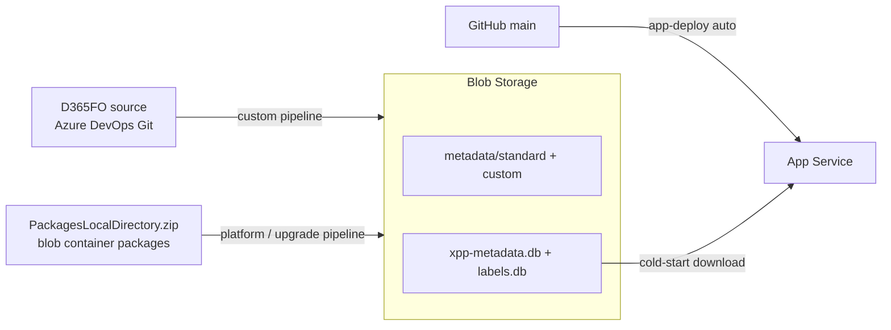

# Azure DevOps Pipelines

Automated metadata extraction, database builds, and app deployment. Manual extraction takes 2–3 hours; these four pipelines reduce routine updates to minutes and remove human error.

---

## The four pipelines

| Pipeline | Purpose | Trigger | Duration |
|----------|---------|---------|----------|
| `d365fo-mcp-app-deploy` | compile + deploy the server to App Service | **auto** on push to `main` (`src/**`, `package.json`, …) | 5–10 min |
| `d365fo-mcp-data-extract-and-build-custom` | refresh **custom models** from the D365FO Git repo | manual | 15–30 min |
| `d365fo-mcp-data-extract-and-build-platform` | refresh **Microsoft standard** models from `PackagesLocalDirectory.zip` | manual | 60–120 min |
| `d365fo-mcp-data-platform-upgrade` | **full version upgrade**: standard + custom + FTS in one run | manual | 90–120 min |

**Storage layout:** `metadata/standard/` (350+ Microsoft models, quarterly) · `metadata/custom/` (your models, on demand) · `database/` (symbols ~2–3 GB + labels ~500 MB). Every data pipeline ends with an App Service restart so the fresh database is downloaded.

---

## Parameters

### custom pipeline

| Parameter | Default | Effect |
|-----------|---------|--------|
| `extractionMode` | `custom` | `custom` / `standard` / `all` |
| `customModels` | `all` | comma-separated model names for targeted (faster) updates |
| `skipExtraction` | `false` | `true` = rebuild the DB from blob metadata only, no Git extraction |

Custom mode is **incremental**: the existing symbols DB is downloaded first, standard models stay indexed, only custom models are replaced.

### platform pipeline

| Parameter | Default | Effect |
|-----------|---------|--------|
| `skipExtraction` | `false` | `true` = skip zip download/extraction, rebuild from blob metadata |

### upgrade pipeline

No parameters. Builds in **two passes** (symbols + labels with `SKIP_FTS=true`, then `npm run build-fts`) to stay inside the hosted agent's 4 GB heap. Requires custom metadata already present in blob — run the custom pipeline first when in doubt.

All data pipelines run with `NODE_OPTIONS=--max-old-space-size=4096 --expose-gc` and `ENABLE_SEARCH_SUGGESTIONS=false` (saves ~1 GB during builds).

---

## Which pipeline when

| Situation | Run |
|-----------|-----|
| Committed custom model changes | **custom** (defaults) |
| Only one model changed | **custom** with `customModels: "YourModel"` (~5–10 min) |
| DB corrupted / rebuild without source change | any data pipeline with `skipExtraction: true` |
| Microsoft hotfix / new version | upload new zip → **platform**; then **custom** if your models changed too |
| Full version upgrade in one shot | upload zip → (**custom** if needed) → **upgrade** |
| First-time setup | variable group → upload zip → **platform** → **custom** → **upgrade** → push to `main` |
| Server code change | nothing — **app-deploy** triggers automatically |

> Always run **platform** before **upgrade** so the latest standard metadata is in blob for the upgrade to consume.

---

## Monitoring & troubleshooting

The app-deploy pipeline polls `/health` every 15 s for up to 10 minutes after deploy — the app downloads the database from blob on cold start (2–5 min is normal).

| Failure | Fix |
|---------|-----|
| "Cannot find variable group" | create/link `xpp-mcp-server-config` in Pipelines → Library |
| "Blob not found" | upload `PackagesLocalDirectory.zip` to container `packages`; run **platform** first to populate `metadata/standard/` |
| "PACKAGES_PATH not found" (custom) | fix the `PACKAGES_PATH` variable to the metadata path inside the Git repo, or use `skipExtraction: true` |
| Heap out of memory | confirm `ENABLE_SEARCH_SUGGESTIONS=false` + 4 GB heap; narrow scope via `customModels` |
| Health check fails after deploy | `az webapp log tail …`; verify `AZURE_STORAGE_CONNECTION_STRING` + `BLOB_CONTAINER_NAME`; wait out the cold-start download |

**Security:** secrets live in the `xpp-mcp-server-config` variable group (or Key Vault); service connections get minimum permissions; the deploy pipeline sets `MCP_SERVER_MODE=read-only` on the App Service automatically.

**Costs:** pipeline minutes ≈ $1–3/month at typical frequencies; blob storage ≈ $0.20–0.30/month including the zip.

---

## See also

[SETUP_AZURE.md](SETUP_AZURE.md) — initial Azure setup and variable group · [ARCHITECTURE.md](ARCHITECTURE.md) — deployment design · GitHub Issues for pipeline problems
