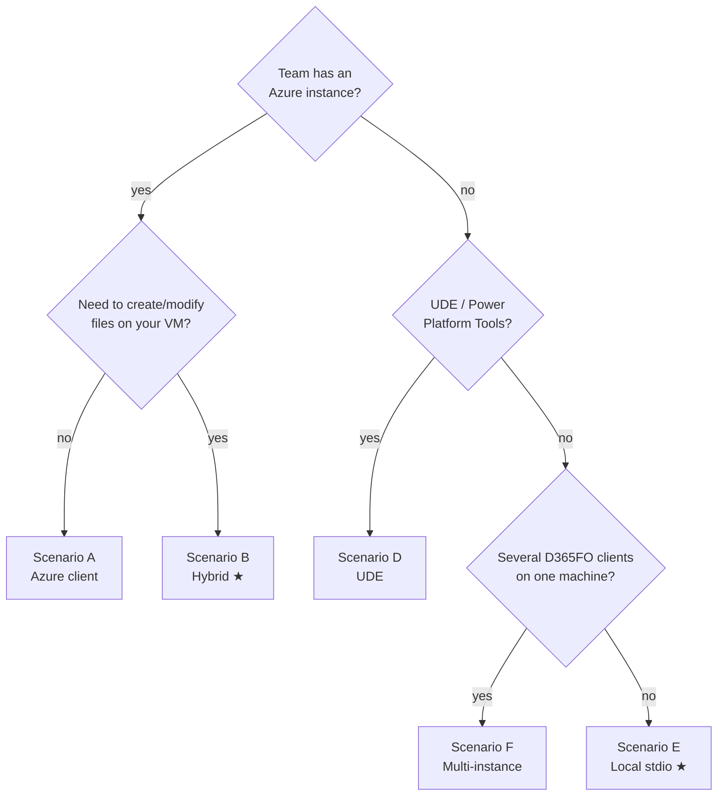

# Setup Guide — Client Configuration

Everything a **developer** needs to connect Claude Code to the D365 F&O MCP Server.

> Fast path: [QUICK_START.md](QUICK_START.md) · Claude Code walkthrough: [CLAUDE_CODE_SETUP.md](CLAUDE_CODE_SETUP.md) · Azure deployment (admins): [README - Azure MCP server for D365FnO - instruction.md](../README%20-%20Azure%20MCP%20server%20for%20D365FnO%20-%20instruction.md) · local single-VM deployment: [README - local MCP server for D365FnO - instruction.md](../README%20-%20local%20MCP%20server%20for%20D365FnO%20-%20instruction.md)

---

## Choosing a scenario



| Scenario | Search index | Writes | Local install | Index build |
|----------|-------------|--------|---------------|-------------|
| **A** — Azure client | Azure | ❌ | none | none |
| **B** — Hybrid ★ | Azure | ✅ local bridge | clone + build | none |
| **C** — Local HTTP | local | ✅ | clone + build | yes |
| **D** — UDE | local | ✅ | clone + build | yes |
| **E** — Local stdio ★ | local | ✅ | clone + build | yes |
| **F** — Multi-instance | local ×N | ✅ | clone + build | per instance |

---

## Prerequisites

| Component | Version | Needed for |
|-----------|---------|-----------|
| Claude Code CLI | latest | MCP client (`npm install -g @anthropic-ai/claude-code`) |
| Node.js + Python | 24.x LTS / 3.x | local & hybrid (native SQLite build) |
| .NET Framework 4.8 Dev Pack | 4.8 | C# bridge — **all writes** (pre-installed on D365FO VMs) |
| Git | any | local & hybrid |

## Register the MCP server (one-time)

Claude Code stores MCP config in `%USERPROFILE%\.claude.json`. Register a server with `claude mcp add-json` (or place a project-scoped `.mcp.json`). The per-scenario commands are below; full walkthrough in [CLAUDE_CODE_SETUP.md](CLAUDE_CODE_SETUP.md).

## Place CLAUDE.md (mandatory)

```powershell
Copy-Item -Path "K:\d365fo-mcp-server\CLAUDE.template.md" -Destination "C:\source\repos\CLAUDE.md"
```

Claude Code reads `CLAUDE.md` upward from the working directory — one copy in a common parent covers all solutions. It delivers the workflow rules (tool routing, confirm-before-write, no terminal file edits) the agent depends on. The same rules live in the repo's `.github/copilot-instructions.md`, which is the source they are copied from. The fuller `xpp_system_instructions` MCP prompt is **opt-in** and must be invoked manually — never rely on it alone.

---

## Scenario A — Azure client

Team server on Azure; you connect read-only. No local install, no index.

```powershell
claude mcp add-json --scope user d365fo-mcp-tools '{"type":"http","url":"https://your-server.azurewebsites.net/mcp/","alwaysLoad":true}'
```

> Cannot write files on your VM and cannot read your workspace context reliably (HTTP has no `env`). For real development use **Scenario B**.

## Scenario B — Hybrid (Azure search + local writes) ★

Azure serves the shared index; a lightweight local companion (starts < 1 s, no database) handles writes via the C# bridge. Claude Code merges both tool lists and routes automatically.

```powershell
git clone https://github.com/tfranczyk/d365fo-mcp-server.git K:\d365fo-mcp-server
cd K:\d365fo-mcp-server
npm install
cd bridge\D365MetadataBridge; dotnet build -c Release; cd ..\..
npm run build
```

```powershell
claude mcp add-json --scope user d365fo-azure '{"type":"http","url":"https://your-server.azurewebsites.net/mcp/","alwaysLoad":true}'

claude mcp add-json --scope user d365fo-local '{"type":"stdio","command":"node","args":["K:\\d365fo-mcp-server\\dist\\index.js"],"env":{"MCP_SERVER_MODE":"write-only","D365FO_SOLUTIONS_PATH":"K:\\repos\\MySolution\\projects","D365FO_WORKSPACE_PATH":"K:\\AosService\\PackagesLocalDirectory\\YourPackage\\YourModel"},"alwaysLoad":true}'
```

The local companion also exposes the bridge-backed reader `get_object_info` (and `get_method`), so freshly created objects are immediately readable without waiting for an Azure index refresh.

**Update:** `git pull && npm install && npm run build` whenever a new version ships.

## Scenario C — Local HTTP

Everything on your VM, served over `http://localhost:8080`.

```powershell
# after clone + build (see B)
copy .env.example .env     # set PACKAGES_PATH, CUSTOM_MODELS
npm run extract-metadata   # custom models: minutes; EXTRACT_MODE=all: 1–2 h
npm run build-database
npm start                  # verify: http://localhost:8080/health
```

```powershell
claude mcp add-json --scope user d365fo-mcp-tools '{"type":"http","url":"http://localhost:8080/mcp/","alwaysLoad":true}'
```

> Prefer **Scenario E** (stdio) when a single client drives the server — no port, no `npm start`, Claude Code launches it for you. Choose local HTTP when **several clients share one code base** (e.g. VS Code + the CLI at the same time): stdio spawns one subprocess per client, each loading its own ~1.5 GB index, whereas a single HTTP instance loads the index once and serves them all.

## Scenario D — UDE (Unified Developer Experience)

The server reads your XPP config from `%LOCALAPPDATA%\Microsoft\Dynamics365\XPPConfig\` automatically — usually no paths needed.

```powershell
claude mcp add-json --scope user d365fo-mcp-tools '{"type":"stdio","command":"node","args":["K:\\d365fo-mcp-server\\dist\\index.js"],"env":{"D365FO_MODEL_NAME":"YourModelName","D365FO_DEV_ENVIRONMENT_TYPE":"ude"},"alwaysLoad":true}'
```

If auto-detection fails, add `D365FO_CUSTOM_PACKAGES_PATH` and `D365FO_MICROSOFT_PACKAGES_PATH` explicitly. For metadata extraction run `npm run select-config` first. Bridge build on UDE needs the DLL path:

```powershell
dotnet build -c Release -p:D365BinPath="<FrameworkDirectory>\bin"
```

## Scenario E — Local stdio ★ (single developer)

Claude Code spawns the server as a subprocess — no HTTP, no manual start. Build the index as in Scenario C, then:

```powershell
claude mcp add-json --scope user d365fo-mcp-tools '{"type":"stdio","command":"node","args":["C:\\d365fo-mcp-server\\dist\\index.js"],"env":{"DB_PATH":"C:\\d365fo-mcp-server\\data\\xpp-metadata.db","LABELS_DB_PATH":"C:\\d365fo-mcp-server\\data\\xpp-metadata-labels.db","D365FO_SOLUTIONS_PATH":"K:\\repos\\MySolution\\projects"},"alwaysLoad":true}'
```

`D365FO_SOLUTIONS_PATH` is scanned for `.rnrproj` files at startup; the MCP roots protocol delivers the open workspace automatically. Switch projects without restart via `get_workspace_info(projectPath=...)`. Details: [WORKSPACE_DETECTION.md](WORKSPACE_DETECTION.md)

## Scenario F — Multiple instances

One machine, several D365FO clients — each instance gets its own `.env`, database, and port:

```powershell
.\instances\add-instance.ps1            # interactive: name + port → instances\<name>\{.env,data,metadata}
# edit instances\<name>\.env: XPP_CONFIG_NAME, EXTENSION_PREFIX, D365FO_MODEL_NAME
.\instances\rebuild-instance.ps1 clientA   # extract + build index for the instance (--all for all)
.\instances\run-instance.ps1 clientA       # start on its port
```

Point a per-solution `.mcp.json` (Claude Code uses the `"mcpServers"` key) at the right port:

```json
{
  "mcpServers": {
    "d365fo-clientA": { "type": "http", "url": "http://localhost:3001/mcp/", "alwaysLoad": true }
  }
}
```

> `rebuild-instance.ps1` diffs each instance `.env` against `.env.example` and warns about new keys — upgrades are safe.

---

## Building the C# bridge

**Mandatory on Windows D365FO VMs** — it is the only write path (`d365fo_file` action=create/modify). Without it the server runs read-only.

```powershell
cd bridge\D365MetadataBridge
dotnet build -c Release        # output: bin\Release\D365MetadataBridge.exe (auto-detected)
```

| Situation | Action |
|-----------|--------|
| UDE box (DLLs not in `PackagesLocalDirectory\bin`) | `dotnet build -c Release -p:D365BinPath="<FrameworkDirectory>\bin"` |
| Restrictive NuGet feed | add `--source https://api.nuget.org/v3/index.json` |
| After a D365FO version upgrade | rebuild to pick up new DLLs |

Healthy startup: `✅ C# bridge initialized (metadataAvailable: true, xrefAvailable: true)`. `xrefAvailable: false` is non-critical (xref tools fall back to SQLite FTS). Full reference: [BRIDGE.md](BRIDGE.md)

---

## Where MCP config lives

| Location | Scope | Use when |
|----------|-------|----------|
| `.mcp.json` in the project root (`"mcpServers"` key) | that project only | per-project servers/ports (Scenario F), shared via version control |
| `%USERPROFILE%\.claude.json` (via `claude mcp add-json --scope user`) | all projects | one environment for everything (recommended) |

The server searches from the working directory up to 5 parent levels.

---

## Troubleshooting

| Symptom | Fix |
|---------|-----|
| Tools don't appear | `claude mcp list` shows the server connected · restart the Claude Code session after changing config |
| Claude routes to built-in search instead of the tools | set `"alwaysLoad": true` on the server · `CLAUDE.md` must exist in a parent of the working directory |
| File created in the wrong model | use the two-level `D365FO_WORKSPACE_PATH`: `...\PackagesLocalDirectory\<Package>\<Model>` — see [WORKSPACE_DETECTION.md](WORKSPACE_DETECTION.md) |
| Local companion won't start | `node --version` (24.x) · re-run `npm install && npm run build` · check the path in `args` |
| Writes fail / bridge missing | build the bridge (above) · check `.NET 4.8` · see startup log flags |
| No search results | Azure: open `/health` in a browser · local: `data/xpp-metadata.db` exists and is > 100 MB |

---

## Next steps

[MCP_CONFIG.md](MCP_CONFIG.md) — every option · [MCP_TOOLS.md](MCP_TOOLS.md) — all 26 tools · [CLAUDE_CODE_SETUP.md](CLAUDE_CODE_SETUP.md) — Claude Code walkthrough · [USAGE_EXAMPLES.md](USAGE_EXAMPLES.md) — real workflows · [CUSTOM_EXTENSIONS.md](CUSTOM_EXTENSIONS.md) — ISV/multi-model · [PIPELINES.md](PIPELINES.md) — automated index refresh
