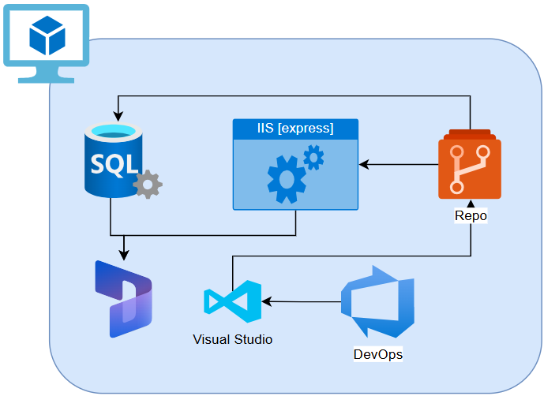
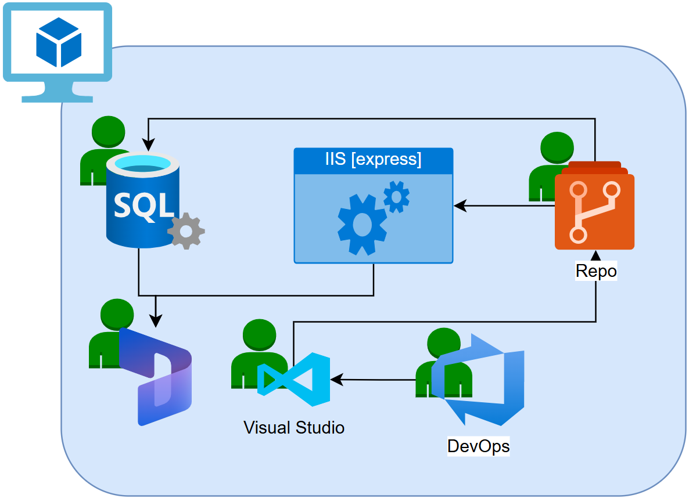
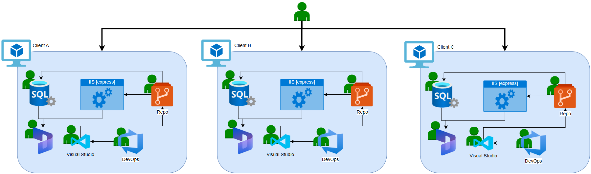
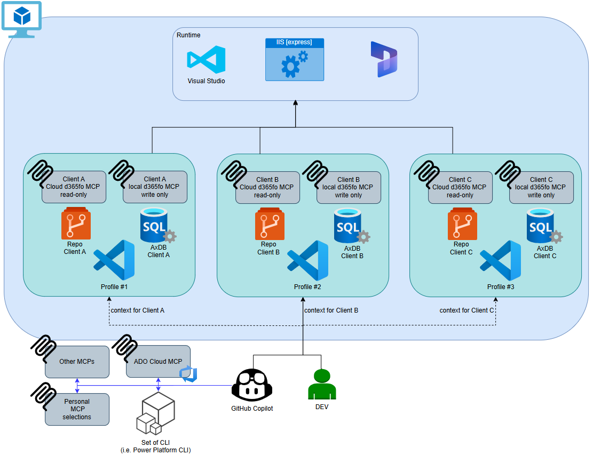
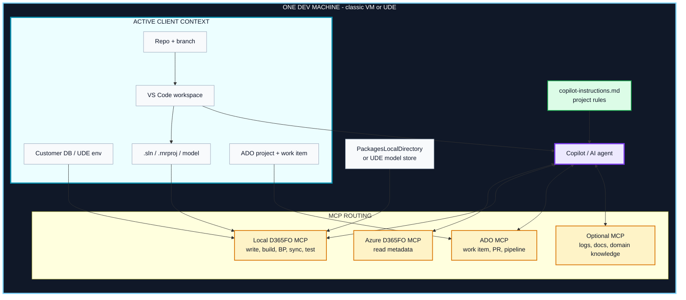
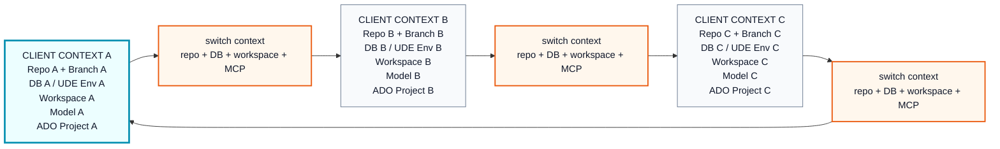
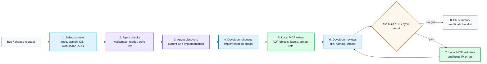
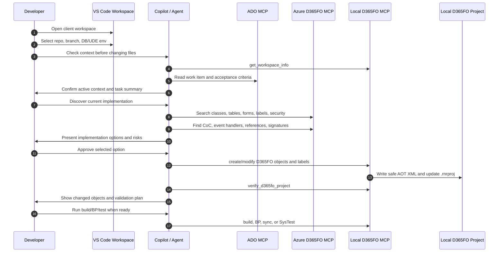
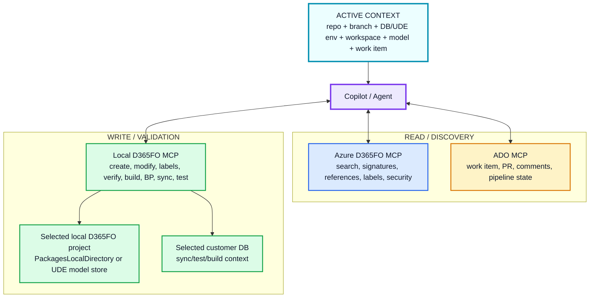

# X++ Development Workflow with MCP

This document explains the new development model for X++ teams working with
MCP, VS Code workspaces, Azure DevOps, and one shared DEV machine pattern. It is
written for developers who already know D365FO and want to understand why this
workflow is worth adopting.

The short version: MCP turns the DEV machine into a context-aware development
cockpit. The developer still makes the decisions, but the agent can now inspect
the right repo, the right customer database, the right model, the right work
item, and the right D365FO metadata before proposing or applying a change.

Setup details live in:

- [README - Azure MCP server for D365FnO - instruction.md](../README%20-%20Azure%20MCP%20server%20for%20D365FnO%20-%20instruction.md)
- [MCP_CONFIG.md](MCP_CONFIG.md)
- [WORKSPACE_DETECTION.md](WORKSPACE_DETECTION.md)
- [.github/copilot-instructions.md](../.github/copilot-instructions.md)

## Why Developers Should Care

The goal is not to add another tool to remember. The goal is to remove the slow,
fragile parts of X++ work:

| Old habit | MCP-assisted habit |
|---|---|
| Search AOT manually before every change | Ask the agent to discover classes, tables, forms, labels, security, CoC, and references |
| Guess method signatures from memory | Pull exact signatures before writing a CoC extension |
| Manually inspect XML and `.rnrproj` files | Let local MCP create and modify AOT objects safely |
| Lose time switching between customers | Switch one explicit client context: repo, DB, workspace, model, ADO |
| Start coding before the real dependency map is known | First get a fast technical map, then prototype |
| Build late and discover obvious issues | Let the agent prepare focused validation steps and fix compiler errors through MCP |

This is still professional X++ development. The difference is that the first
draft of understanding is much faster and the dangerous file operations are
handled through D365FO-aware tools.

## The New Mental Model

There is one developer machine. It can be a classic D365FO DEV VM or a UDE-based
environment. The developer moves between customer contexts on that machine.

A context switch is not just "open another folder". It is a coordinated switch
of:

- local Git repo and branch,
- customer database or UDE environment,
- VS Code workspace,
- D365FO solution, `.rnrproj`, package, and model,
- Azure DevOps project and work item,
- MCP configuration,
- project-specific instructions.

In terms of an old-fashioned approach to development we have a typical topology:



A developer used a set of tools to achieve the goal.



Finally, if looked at the switching context perspective, a developer had to switch between VMs.



With the new approach, powered by Copilot for Github (or any other similar tool), switching context perspective is hosted on a single VM, when the initial tool used to investigate a development starts with VS code, connected to Github Copilot. A set of MCP engines is used to coordinate the development work from the organization perspective (Coding Standard, Anegis Knowledge Base, Azure DevOps), then a VS code is opened with a selected profile to switch between the Client's environments, repositories, D365FnO versions.





The active context is dynamic. That is the power of the model. But the context
must be explicit. If the developer switches from Client A to Client B, the agent
must also switch from Client A to Client B.



## The Developer Loop

The new loop starts with context, not code.



This loop is intentionally collaborative:

- The developer owns the requirement, technical decision, and review.
- The agent gathers facts, proposes options, and applies mechanical changes
  through MCP.
- Local MCP performs D365FO-safe writes.
- Azure MCP supplies fast read access to indexed metadata.
- ADO MCP keeps the work item, branch, PR, and pipeline context visible.

## What Happens When a Bug Arrives



## Context Layers

### 1. Project Instructions

`.github/copilot-instructions.md` is the agent's baseline policy for the
project. It should travel with the repo or live in a shared parent folder used
by the team's workspaces.

It tells the agent to:

- call `get_workspace_info` before D365FO work,
- never guess method signatures,
- never manually edit `.xml`, `.xpp`, `.label.txt`, or `.rnrproj` files,
- use `create_d365fo_file` and `modify_d365fo_file` for D365FO changes,
- search existing labels before creating new ones,
- run builds only when the developer explicitly asks for them.

These rules are not bureaucracy. They are what prevents the agent from acting
like a generic text editor in a system where XML shape, project membership,
labels, metadata, and model context all matter.

### 2. Azure D365FO MCP

Azure MCP is the fast shared read layer for the selected customer/project
metadata set. Use it to understand:

- classes, methods, tables, EDTs, enums, forms, reports,
- Chain of Command and event handlers,
- security hierarchy,
- label reuse,
- implementation patterns and API usage.

Azure MCP reflects the last indexed state. It is excellent for understanding the
committed or published shape of the system, but it may not know about local
uncommitted changes.

### 3. Local D365FO MCP

Local MCP is the write and validation layer on the developer machine. It has
access to the selected `PackagesLocalDirectory` or UDE model store, `.rnrproj`,
local Git repo, customer DB/environment, and D365FO tooling.

Use it for:

- creating or modifying AOT objects,
- creating or renaming labels,
- verifying project membership,
- build, BP check, database sync, and SysTest when requested.

In the hybrid setup, local MCP usually runs as a `write-only companion`, while
Azure MCP runs as `read-only`. Copilot sees both servers, but correct behavior
depends on the active context being correct.

### 4. ADO MCP

ADO MCP keeps delivery context close to the code:

- work item, bug, change request, and acceptance criteria,
- related branches, PRs, and comments,
- pipeline status and validation results,
- area/iteration context when needed.

ADO MCP should be scoped to the active client/project. At the start of a task,
the agent should be able to say which work item, repo, branch, and PR context it
is using.

### 5. Optional MCP Servers

Optional MCP servers can add customer documentation, integration specs, logs,
telemetry, or domain knowledge. Treat each one as part of the active context:

- what it is for,
- when it should be used,
- whether it is authoritative,
- whether it may contain sensitive data.

## The First Prompt Should Set Context

Good first prompt:

```text
Check the active context before changing files.
Confirm repo, branch, customer DB/UDE environment, VS Code workspace,
D365FO model, .rnrproj, ADO project, and work item.
Then summarize the requirement and list the D365FO objects to inspect.
```

Bad first prompt:

```text
Fix this bug.
```

The second prompt should ask for discovery:

```text
Find the current implementation related to [area].
Check classes, tables, forms, CoC extensions, event handlers, labels,
security, and references. Show implementation options before editing.
```

Only after the developer accepts a direction should the agent write files:

```text
Implement option A through local MCP.
Search labels first, create missing labels only if needed,
verify the .rnrproj, and do not run a build unless I ask.
```

## Read and Write Routing



## Responsibility Split

| Area | Developer | Agent with MCP |
|---|---|---|
| Context | Selects the correct client workspace | Confirms repo, branch, DB/env, model, work item |
| Requirement | Decides what must be delivered | Summarizes work item and identifies gaps |
| Code analysis | Judges the direction | Finds objects, signatures, references, patterns |
| Design | Chooses the implementation approach | Proposes options, risks, and validation steps |
| Implementation | Approves and reviews | Creates or modifies objects through local MCP |
| Validation | Decides when to build/test | Runs build/BP/sync/test on request and analyzes errors |
| PR | Owns final quality | Drafts PR description and review checklist |

## Anti-Patterns

Avoid:

- starting with "write the code" before checking the active client context,
- working in the wrong repo, branch, DB, workspace, or ADO project,
- guessing the model, package path, or `.rnrproj`,
- manually editing D365FO XML or `.rnrproj` instead of using local MCP,
- creating labels before searching existing labels,
- writing Chain of Command without the exact method signature,
- treating Azure MCP as if it knows local uncommitted changes,
- running long builds without developer approval,
- ignoring project-specific instructions.

## Minimal Start Checklist

Before implementation starts, the developer and agent should know:

- Which client context is active?
- Which repo and branch are selected?
- Which customer DB or UDE environment is active?
- Which VS Code workspace is open?
- Which `.sln`, `.rnrproj`, package, and model are active?
- Which ADO project and work item are in scope?
- Which MCP servers are connected for read, write, ADO, and optional context?
- Which project instructions are loaded?

## Target Outcome

The desired result is not "AI writes X++". The desired result is a better
development loop:

- context is checked before code changes,
- discovery is faster,
- prototypes are safer,
- XML/project mutations go through D365FO-aware tools,
- validation is more focused,
- PRs explain the change with better technical context.

The developer remains the engineer. MCP gives the agent enough local and
project-specific awareness to become a useful pair, not a generic autocomplete.
